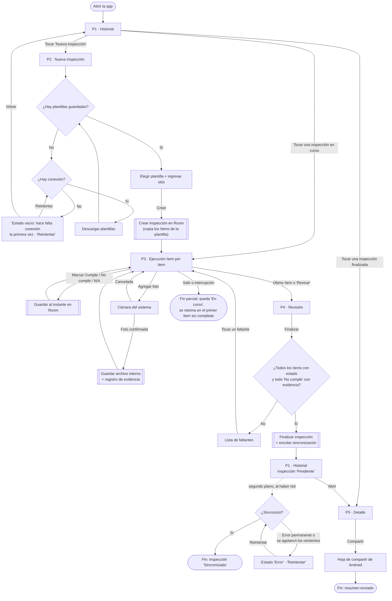
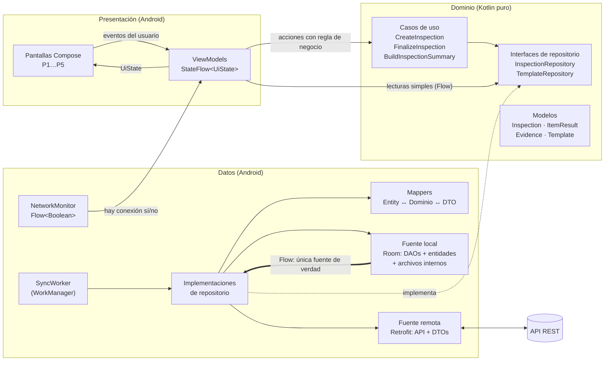
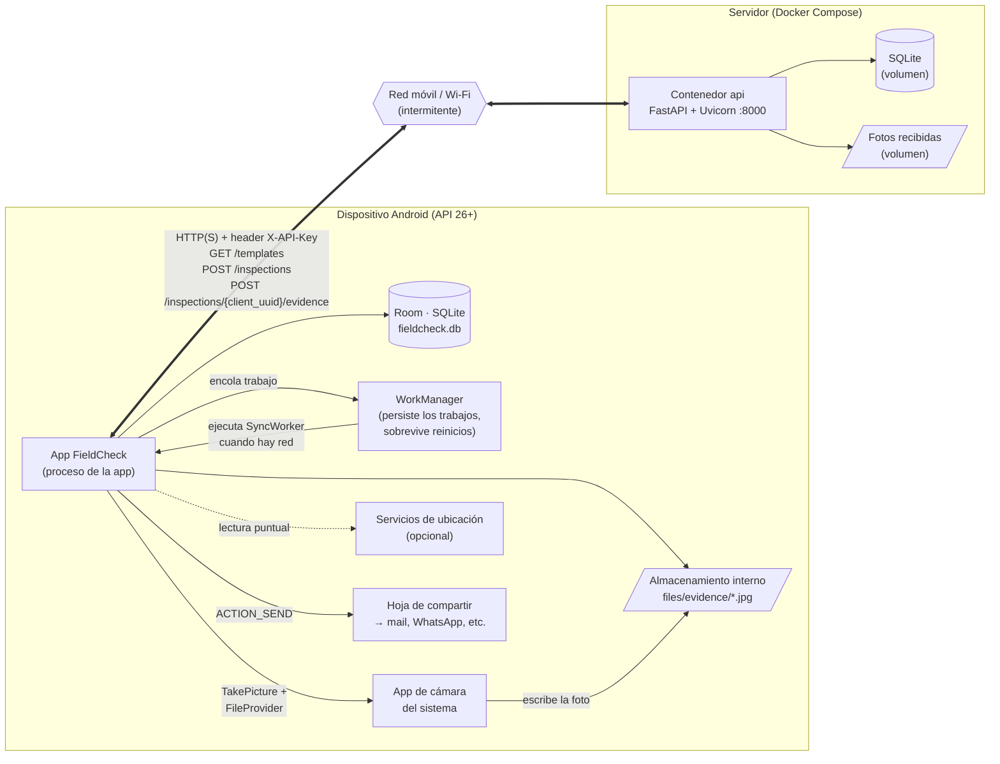
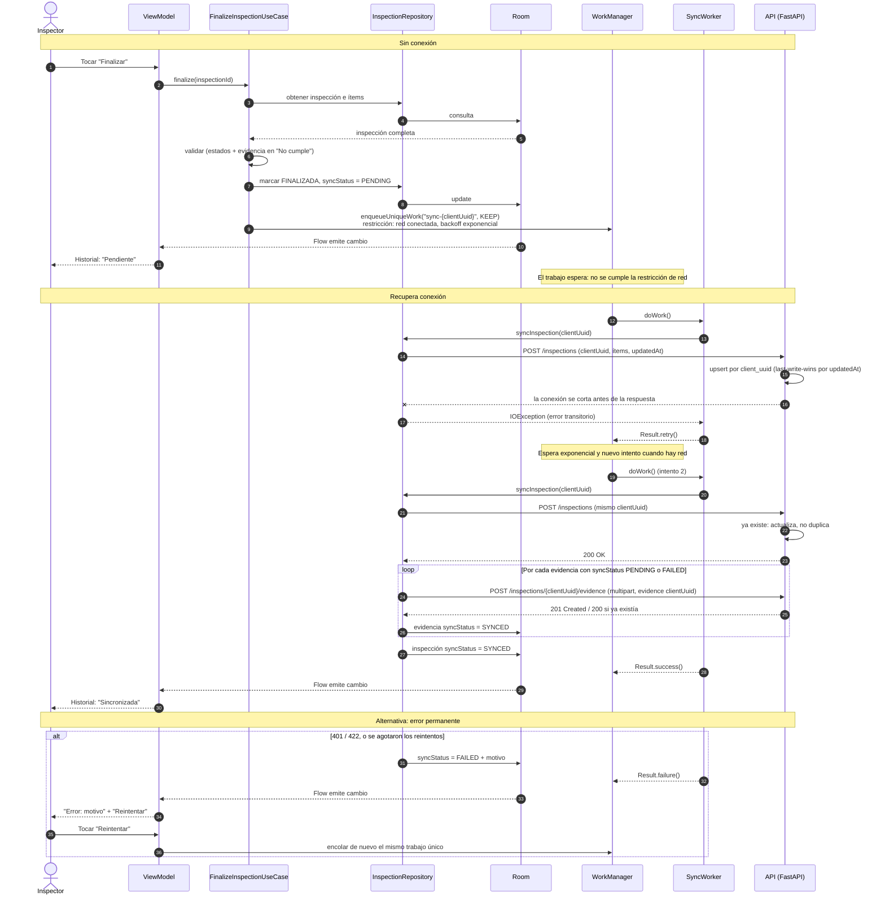
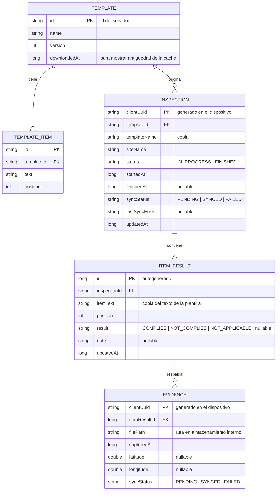

# FieldCheck — Diagramas

Diagramas de la preentrega en Mermaid (se ven directamente en GitHub). Cada uno tiene una explicación pensada para defenderlo oralmente: qué muestra, cómo leerlo y qué preguntas puede disparar.

1. [Flujo de pantallas del caso de uso principal](#1-flujo-de-pantallas-del-caso-de-uso-principal)
2. [Arquitectura: flujo de datos por capas](#2-arquitectura-flujo-de-datos-por-capas)
3. [Arquitectura: topología de infraestructura](#3-arquitectura-topología-de-infraestructura)
4. [Secuencia de sincronización](#4-secuencia-de-sincronización)
5. [Modelo de datos local (Room)](#5-modelo-de-datos-local-room)

---

## 1. Flujo de pantallas del caso de uso principal

Caso de uso: **realizar una inspección en campo y dejarla sincronizada**. Cubre RF01, RF02, RF03 y RF04.

**Cómo defenderlo**

- **Punto de entrada:** la app siempre abre en el Historial. Es la pantalla que responde "¿qué tengo pendiente?", que es lo primero que necesita el inspector.
- **Operaciones críticas** (doble borde): crear la inspección, guardar cada respuesta, guardar la foto y finalizar. Todas escriben en Room, ninguna depende de la red. Por eso ninguna tiene una rama "sin conexión".
- **Decisiones:** hay tres en el flujo del usuario. (1) Si hay plantillas guardadas; es el único punto donde la conectividad importa, y solo la primera vez. (2) La validación al finalizar, que aplica la regla de negocio del RF02. (3) El resultado de la sincronización, que ocurre en segundo plano (línea punteada) y el usuario no espera.
- **Finales posibles:** inspección sincronizada, resumen compartido, o inspección en curso interrumpida. Este último no es un error: está diseñado así (RNF02 y RNF05).
- **Prevención de errores:** la validación no muestra un mensaje genérico, lista los faltantes y cada uno lleva directo al ítem que hay que completar.
- **Pregunta probable: "¿por qué la cámara no tiene una rama de permiso rechazado?"** Porque usamos la cámara del sistema mediante un intent (`TakePicture`), que no requiere el permiso `CAMERA`. El único permiso de la app es la ubicación (deseable). Si se rechaza, la foto se guarda igual sin coordenadas.

---

## 2. Arquitectura: flujo de datos por capas

**Cómo defenderlo**

- **Dirección de las dependencias:** Presentación y Datos dependen de Dominio. Dominio no depende de nadie: no importa nada de Android, Room ni Retrofit. La flecha punteada "implementa" es la inversión de dependencias: el dominio define el contrato (`InspectionRepository`) y la capa de datos lo cumple. Por eso los casos de uso se testean con un repositorio falso, sin emulador.
- **Cómo circulan los datos, lectura:** Room emite un `Flow` → el repositorio lo mapea a modelos de dominio → el ViewModel lo transforma en `UiState` → Compose lo dibuja. Cuando cambia algo en Room, la pantalla se actualiza sola. La UI **nunca** lee de la red (línea gruesa: única fuente de verdad).
- **Cómo circulan los datos, escritura:** evento de la UI → ViewModel → caso de uso (si hay regla) → repositorio → Room. El `Flow` anterior propaga el cambio a la pantalla.
- **Red:** solo la usan el `SyncWorker` (para enviar inspecciones) y el repositorio de plantillas (para refrescar la caché). Lo que traen de la red lo escriben en Room, nunca lo pasan directo a la UI.
- **Por qué no todo pasa por un caso de uso:** listar el historial es una lectura sin reglas. Un `GetInspectionsUseCase` que solo llama al repositorio sería una capa vacía. Los casos de uso existen donde hay lógica: copiar los ítems de la plantilla, validar la finalización y armar el resumen.
- **`NetworkMonitor`:** solo alimenta el banner offline de la UI. La decisión de cuándo sincronizar es de WorkManager, con su restricción de red.
- **Mappers:** separan tres formas del mismo dato. La entidad de Room está optimizada para la base, el DTO sigue el formato JSON de la API y el modelo de dominio es el que usa la app. Si cambia la API, cambian el DTO y el mapper, no la UI.

---

## 3. Arquitectura: topología de infraestructura

**Cómo defenderlo**

- **Qué corre dónde:** en el dispositivo están la app, su base Room, las fotos en almacenamiento interno y WorkManager. En el servidor hay un solo contenedor con FastAPI, que guarda los datos en SQLite y las fotos en disco. Ambos van en volúmenes de Docker para que no se pierdan al recrear el contenedor.
- **La red es el eslabón débil** (hexágono): el diseño asume que está cortada la mayor parte del tiempo en campo. Todo lo que está a la izquierda funciona sin ella.
- **WorkManager aparece como componente propio** porque tiene su propia persistencia: si el teléfono se reinicia con una inspección pendiente, el trabajo sigue encolado y se ejecuta cuando vuelve la red, sin abrir la app.
- **La cámara es otra app:** la nuestra le presta un archivo propio mediante `FileProvider` (una URI temporal con permiso de escritura) y la cámara escribe ahí. La foto nunca pasa por la galería (RNF08).
- **Entorno de desarrollo:** el servidor corre en la notebook con `docker compose up`. Desde el emulador, la notebook se ve como `10.0.2.2` (no `localhost`, que sería el propio emulador). En local se usa HTTP permitido solo para ese host en debug; un despliegue en la nube usaría HTTPS.
- **Seguridad:** la API key viaja en un header y se configura fuera del código fuente (`local.properties` → `BuildConfig`). Es una protección mínima acorde a una v1 sin usuarios; lo reconocemos como limitación.
- **Pregunta probable: "¿por qué SQLite en el servidor?"** Porque hay un solo escritor lógico por inspección y la carga es de demo. Postgres agregaría otro contenedor sin cambiar nada de lo que se evalúa en la app.

---

## 4. Secuencia de sincronización

Escenario: el inspector finaliza sin señal, la red vuelve más tarde y, en el primer intento, se corta la conexión justo después de que el servidor guardó los datos.

**Cómo defenderlo**

- **Con conexión:** el mismo flujo, solo que el trabajo se ejecuta enseguida después de encolarse. No hay un camino especial "online": un solo camino es más fácil de probar.
- **Pérdida de conexión:** finalizar nunca falla por falta de red, porque solo escribe en Room y encola. El usuario ve "Pendiente" al instante (pasos 1–10).
- **Recuperación:** WorkManager despierta el worker cuando se cumple la restricción de red, aunque la app esté cerrada.
- **El caso difícil (pasos 14–17):** el servidor guardó los datos pero el teléfono no recibió la respuesta. Sin idempotencia, el reintento crearía una inspección duplicada. Con el `clientUuid` generado en el dispositivo, el servidor reconoce que ya la tiene y actualiza. Esto responde "¿cómo se manejan los errores de sincronización?".
- **Orden: primero datos, después fotos.** Las fotos referencian a la inspección por su `clientUuid`, así que la inspección tiene que existir primero. Además, si se corta a mitad de las fotos, las que ya subieron quedan `SYNCED` y el reintento solo sube las que faltan.
- **Transitorio vs. permanente:** un timeout o un 5xx se reintentan solos (`Result.retry()`); un 401 o un 422 no se arreglan reintentando, así que pasan a `FAILED` y el usuario decide.
- **Trabajo único por inspección (`KEEP`):** si ya hay un trabajo encolado para esa inspección, no se crea otro. Evita dos envíos en paralelo de lo mismo.
- **Conflictos:** después de finalizar, la inspección es de solo lectura en la app, y cada inspección tiene un único dueño. El *last-write-wins* del servidor queda como red de seguridad, no como mecanismo principal.

---

## 5. Modelo de datos local (Room)

**Cómo defenderlo**

- **Dos grupos de datos:** `TEMPLATE` y `TEMPLATE_ITEM` vienen de la API y son una caché que se puede reemplazar entera. `INSPECTION`, `ITEM_RESULT` y `EVIDENCE` los genera el usuario, solo existen en el dispositivo hasta que se sincronizan y nunca se pisan con datos del servidor.
- **Copia del texto del ítem (`itemText`, `templateName`):** es una decisión deliberada de desnormalización. Una inspección es un registro histórico: si mañana la plantilla cambia, la inspección de hoy tiene que seguir mostrando lo que se revisó. Por eso `ITEM_RESULT` no depende de `TEMPLATE_ITEM` después de creada.
- **Claves generadas en el dispositivo (`clientUuid`):** permiten crear registros sin conexión, sin esperar un id del servidor, y son la base de la idempotencia de la sincronización (diagrama 4).
- **`syncStatus` como cola (patrón *outbox*):** el worker consulta "todo lo que esté `PENDING` o `FAILED`". No hace falta una tabla de cola aparte, porque el estado vive junto al dato que describe.
- **`syncStatus` en `EVIDENCE` además de en `INSPECTION`:** las fotos son lo más pesado y lo que más probablemente falle con señal débil. Llevar el estado por foto permite reanudar donde se cortó.
- **Las fotos no se guardan en la base:** Room guarda la ruta, el archivo vive en `files/evidence/`. Guardar blobs en SQLite agranda la base y empeora las consultas.
- **`result` nullable:** `null` significa "sin completar". Es lo que permite calcular el progreso ("12 de 20") y validar la finalización.
- **Borrado en cascada:** `INSPECTION → ITEM_RESULT → EVIDENCE` se define con `onDelete = CASCADE`. Si en el futuro se borra una inspección, no quedan huérfanos (los archivos de las fotos se borran desde el repositorio).
